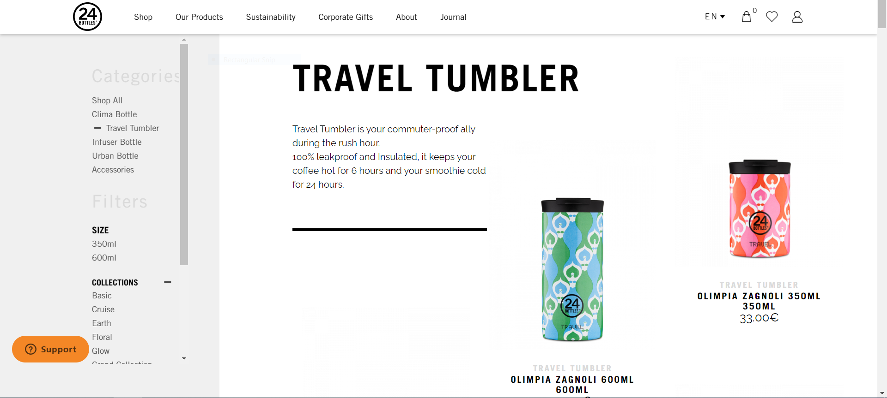

## Product Page List (PLP)

La pagina di lista prodotti la trovo originale, e minimalista. Ha un titolo grande che mi piace e l'ovvietivo della pagin è chiaro.

Da migliorare su questa pagina è il menu sidebar che trovo difficile da usare e poco utile. Tra i problemi di usabilità ci sono:

1. Poco contrasto tra il secondo titolo e lo sfondo (contrasto di 1.22)
2. Inconsistenza nell'icona "-" (minus) che si usa sia per segnalare la categoria attiva che per fare toggle del accordion di "collection"
3. Utilizzo poco efficienti dello spazio disponibilie incrementando il costo d'interazione

##### Soluzione
Cambiare il desing (compresi colori) della sidebar in modo di unificare il comportamento tra tutte le voci. Utilizzare più icona invece che testo con priorita sui colore (un cerchio rosso al posto che la parola "rosso"). Togliere li accordion potrebbe migliorare molto la esperienza utente. La sfida più grande ma non imposibile sarà quella di unire la UX con il SEO visto che per questioni technologiche il contenuto si può visualizzare tramite URL.

Product Detail Page (PDP)

La pagina prodotto è in linea con il degign della azienda. E' semplice allo stesso tempo che fa vedere tutta l'informazione che serve.

Da migliorare su questa pagina ci sono alcune cose molto importanti visto che l'ovvietivo su questa pagina è aggiungere un prodotto al carrello.
Io spenderei tutto il tempo disponibilie su questa pagina perchè ancora più importante che il checkout (la PDP deve convincere l'utente di comprare invece il checkout debe aiutare l'utente a pagare dopo essere sicuro che vuole comprare).

1. La call to action (CTA) è in linea con il sito (voce "add to cart" in grigio), ma questo fa allontanare al cliente dalla azienda al posto che farlo avvicinare. La CTA deve catturare l'atenzione del cliente.
2. Il testo nero con uno sfondo di testo grigio non si legge bene. Fa confondere ed è difficile leggere quello importante.
3. La descrizione prodotto è un elenco di testo. Il cliente vuole solo capire se serve quello che sta vedendo intanto prova ad immaginare comm'è.
4. Non si utilizano strategie di vendite ne segni cognitivi sulla pagina prodotto.

##### Soluzione
Utilizare un contrasto alto per il CTA: blu o verde potrebbero andare molto bene con il design attuale. Cambiare il design sulla destra in modo di leggere il testo nero su uno sfondo bianco allo stesso tempo che si mantiene l'effetto paralax. Aggiungere segni cognitivi insieme altre strategie di vendite avranno un efetto positivo sulle vendite aziendali.

### Checkout page

La checkout page è molto facile da usare e come utente io mi fiderei dell'e-commerce perche mi sembra sicuro. Assolutamente c'è un bel lavoro su questa pagina.

Da migliorare c'è più lato business che lato technologico. Il checkout page l'ultima opportunita che c'è con il cliente per vendere.

##### Soluzione
Aggiungere strategie di cross-selling del tipo "altri utenti come te hanno anche comprato questi prodotti" (solitamente sono accessori) e anche strategie di up-selling del tipo "personalizza la tua bottiglia per solo 6 euro e avrai la spedizione gratis" (quando il totale non arriva a 49 euro).

### Generale
- E' difficile capire i form e voci
- Non è homogeneo l'uso della proprieta "cursor pointer" sui pulsanti
- Poco contrasto con i colori
- Problemi si UX relati alla lingua del sito
- Testo non ottimo per raggiungere la miglior conversione sul pulsante "support"
- Flusso per fare nuovo utente è difficile di capire
- Backend non ha onboarding
